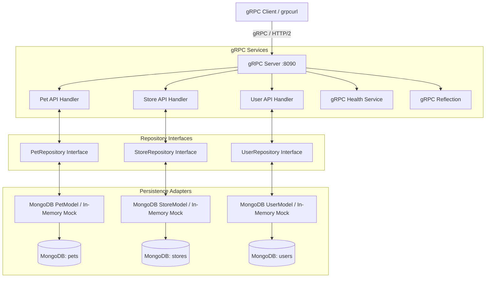

# Go gRPC Petstore Server (MongoDB)

[](https://github.com/middleland/go-servergrpc-petstore/actions/workflows/ci.yml)
[](https://golang.org)
[](https://grpc.io/)
[](https://www.mongodb.com/)
[](LICENSE)

A high-performance, modular microservice implementation of the [OpenAPI Petstore 2.0](http://petstore.swagger.io) specification built with **Go**, **gRPC**, **Protocol Buffers**, and **MongoDB**.

---

## Table of Contents

- [Features](#features)
- [Architecture](#architecture)
- [Prerequisites](#prerequisites)
- [Getting Started](#getting-started)
  - [1. Quick Start with Docker Compose](#1-quick-start-with-docker-compose)
  - [2. Local Development & Makefile](#2-local-development--makefile)
  - [3. Test with grpcurl & Reflection](#3-test-with-grpcurl--reflection)
  - [4. Running Tests](#4-running-tests)
- [API Implementation Status](#api-implementation-status)
- [Project Structure](#project-structure)
- [Documentation & ADRs](#documentation--adrs)
- [License](#license)

---

## Features

- **gRPC & Protocol Buffers**: High-throughput binary serialization with strong typing and schema evolution.
- **gRPC Server Reflection**: Dynamic service inspection without needing local `.proto` files (`reflection.Register`).
- **Standard Health Checks**: Built-in support for the gRPC Health Checking Protocol (`grpc.health.v1.Health`).
- **MongoDB Persistence & Indexing**: Document storage with unique constraints and compound query indexes.
- **Clean Architecture & Mappers**: Strict separation between gRPC transport DTOs and MongoDB persistence entities using repository interfaces.
- **100% Mock Unit Testing**: Fast in-memory mock repository layer for unit tests without requiring a running database.
- **Context Propagation**: Native `context.Context` cancellation and deadline propagation through handler and database layers.
- **Structured Colored Logging**: Zero-dependency ANSI colored console logging with severity levels.
- **Graceful Shutdown**: Intercepts `SIGINT`/`SIGTERM` to allow in-flight RPCs to complete cleanly before terminating.
- **Hardened Distroless Containers**: Minimal, non-root multi-stage Docker builds (`gcr.io/distroless/static-debian12`).
- **Docker Compose & Makefile**: Turnkey local development workflows.

---

## Architecture



For more details, see the [System Architecture Documentation](docs/architecture.md).

---

## Prerequisites

- **Go**: 1.25 or later
- **Docker & Docker Compose**: For running MongoDB and containerized deployments
- **grpcurl** *(optional)*: For CLI-based gRPC testing

---

## Getting Started

### 1. Quick Start with Docker Compose

Spin up both MongoDB and the gRPC server with one command:

```bash
make compose-up
# Or directly:
docker compose up -d
```

### 2. Local Development & Makefile

Use the provided `Makefile` for common developer tasks:

```bash
# Build the binary
make build

# Run the server locally
make run

# Run all unit tests
make test

# Generate HTML coverage report
make test-coverage

# Build Docker image
make docker-build

# Clean build artifacts
make clean
```

#### Configuration & Environment Variables

| Variable / Flag | Default | Description |
| :--- | :--- | :--- |
| `SERVER_ADDR` / `-serverAddr` | `localhost:8090` | gRPC server network address |
| `MONGO_URI` / `-mongoURI` | `mongodb://localhost:27017` | MongoDB connection URI |
| `MONGO_DATABASE` / `-mongoDatabase` | `petstore` | MongoDB database name |
| `ENABLE_CREDENTIALS` / `-enableCredentials` | `false` | Enable MongoDB username/password auth |

---

### 3. Test with grpcurl & Reflection

Because **gRPC Reflection** is enabled, you can inspect and call the server directly without pointing to `.proto` files:

```bash
# List available services
grpcurl -plaintext localhost:8090 list

# Describe service definition
grpcurl -plaintext localhost:8090 describe petstore.SwaggerPetstoreService

# Add a pet
grpcurl -plaintext \
  -d '{"body": {"id": 1001, "name": "Doggie", "status": "STATUS_AVAILABLE"}}' \
  localhost:8090 petstore.SwaggerPetstoreService/AddPet

# Get pet by ID
grpcurl -plaintext \
  -d '{"petId": 1001}' \
  localhost:8090 petstore.SwaggerPetstoreService/GetPetById

# Query pet store inventory
grpcurl -plaintext localhost:8090 petstore.SwaggerPetstoreService/GetInventory

# Check health status
grpcurl -plaintext -d '{"service": "petstore.SwaggerPetstoreService"}' localhost:8090 grpc.health.v1.Health/Check
```

---

### 4. Running Tests

The test suite contains both pure in-memory **unit tests** and MongoDB **integration tests**:

```bash
# Run unit & integration tests
make test

# Generate coverage report
make test-coverage
```

---

## API Implementation Status

| Service | Status | Endpoints |
| :--- | :--- | :--- |
| **Pet** | ✅ Complete | `AddPet`, `GetPetById`, `FindPetsByStatus`, `FindPetsByTags`, `UpdatePet`, `UpdatePetWithForm`, `DeletePet`, `UploadFile` |
| **Store** | ✅ Complete | `PlaceOrder`, `GetOrderById`, `DeleteOrder`, `GetInventory` |
| **User** | ✅ Complete | `CreateUser`, `CreateUsersWithArrayInput`, `CreateUsersWithListInput`, `GetUserByName`, `UpdateUser`, `DeleteUser`, `LoginUser`, `LogoutUser` |
| **Health** | ✅ Complete | `Check`, `Watch` (`grpc.health.v1.Health`) |
| **Reflection**| ✅ Complete | `ServerReflectionInfo` (`grpc.reflection.v1alpha`) |

---

## Project Structure

```
go-servergrpc-petstore/
├── .github/workflows/          # CI/CD GitHub Actions workflows
├── docs/                       # Project documentation & Architecture Decision Records
│   ├── architecture.md         # System architecture and layer design
│   ├── api-guide.md            # gRPC API reference & grpcurl examples
│   └── adr/                    # Architecture Decision Records (ADRs)
├── petstore/                   # Core business logic & gRPC service implementation
│   ├── api_pet.go              # Pet service handlers
│   ├── api_store.go            # Store service handlers
│   ├── api_user.go             # User service handlers
│   ├── repository.go           # Repository interfaces (PetRepository, StoreRepository, UserRepository)
│   ├── *_mapper.go             # DTO <-> MongoDB Entity mappers
│   ├── mongo_*_model.go        # MongoDB repository operations & indexing
│   ├── petstore.pb.go          # Generated Protobuf code
│   ├── petstore_grpc.pb.go     # Generated gRPC service stubs
│   ├── mocks_test.go           # In-memory mock repositories for unit testing
│   ├── unit_handler_test.go    # Pure unit tests (no DB required)
│   └── *_test.go               # Integration & mapper tests
├── protobuffer/                # Protocol Buffer definitions
│   └── swaggerpetstore/
│       └── petstore.proto      # Proto3 service schema
├── docker-compose.yml          # Local multi-container development environment
├── Dockerfile                  # Multi-stage Distroless build
├── Makefile                    # Developer workflow automation
├── main.go                     # Server bootstrap & lifecycle management
└── README.md
```

---

## Documentation & ADRs

Detailed documentation and Architecture Decision Records (ADRs) are available in the [`docs/`](docs/) directory:

- 📖 **[System Architecture](docs/architecture.md)**
- 📖 **[gRPC API Guide](docs/api-guide.md)**
- 🏛️ **[Architecture Decision Records (ADRs)](docs/adr/README.md)**:
  - [ADR-0001: Use gRPC and Protocol Buffers for Petstore Service](docs/adr/0001-use-grpc-and-protocol-buffers.md)
  - [ADR-0002: Migrate Persistence from Redis to MongoDB](docs/adr/0002-migrate-persistence-from-redis-to-mongodb.md)
  - [ADR-0003: Separate Transport DTOs from MongoDB Entities via Mappers](docs/adr/0003-dto-entity-separation-and-mapper-layer.md)
  - [ADR-0004: Standardize Context Propagation and Colored Logging](docs/adr/0004-context-propagation-and-structured-logging.md)
  - [ADR-0005: Multi-Stage Docker Builds with Distroless Base Images](docs/adr/0005-distroless-container-and-multi-stage-builds.md)
  - [ADR-0006: Unified Configuration and Graceful Server Shutdown](docs/adr/0006-server-lifecycle-and-graceful-shutdown.md)
  - [ADR-0007: gRPC Server Reflection and Standard Health Checks](docs/adr/0007-grpc-reflection-and-health-checks.md)
  - [ADR-0008: Repository Interfaces and Unit Testing with Mocks](docs/adr/0008-repository-interfaces-and-unit-testing-with-mocks.md)

---

## License

This project is licensed under the Apache 2.0 License - see the [LICENSE](LICENSE) file for details.
