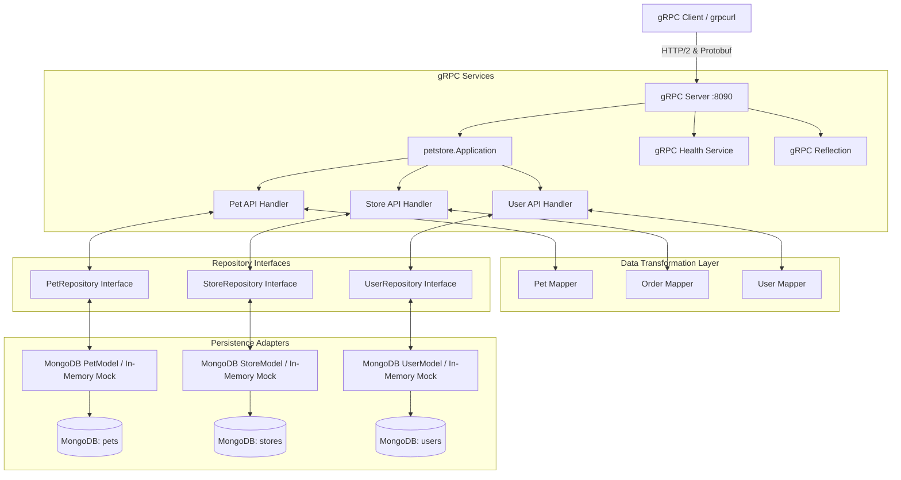

# System Architecture

The **Go gRPC Petstore Server** is a modular microservice written in Go that implements the OpenAPI Petstore 2.0 specification over gRPC and Protocol Buffers, backed by MongoDB.

## Architecture Overview



---

## Key Components

### 1. Entry Point (`main.go`)
- Initializes command-line flags (`-serverAddr`, `-mongoURI`, `-mongoDatabase`, `-enableCredentials`).
- Connects to MongoDB with configurable timeouts and credentials.
- Configures ANSI color logging (`ColoredWriter`).
- Registers gRPC Server Reflection (`reflection.Register`).
- Registers gRPC Health Checking Service (`grpc_health_v1.RegisterHealthServer`).
- Ensures MongoDB unique and compound query indexes on startup (`EnsureIndexes`).
- Starts gRPC listener on TCP port `8090` (default).
- Manages graceful shutdown intercepting `SIGINT` and `SIGTERM`.

### 2. Service Implementation (`petstore/api_*.go`)
Implements the gRPC service interface `SwaggerPetstoreServiceServer`:
- **`api_pet.go`**: Pet management operations (`AddPet`, `GetPetById`, `FindPetsByStatus`, `FindPetsByTags`, `UpdatePet`, `UpdatePetWithForm`, `DeletePet`, `UploadFile`).
- **`api_store.go`**: Order processing & inventory queries (`PlaceOrder`, `GetOrderById`, `DeleteOrder`, `GetInventory`).
- **`api_user.go`**: User account management & sessions (`CreateUser`, `CreateUsersWithArrayInput`, `CreateUsersWithListInput`, `GetUserByName`, `UpdateUser`, `DeleteUser`, `LoginUser`, `LogoutUser`).

### 3. Repository Interfaces & Adapters (`petstore/repository.go`, `petstore/mongo_*_model.go`)
Decouples service handlers from underlying storage:
- Defines clean `PetRepository`, `StoreRepository`, and `UserRepository` interfaces.
- Provides production MongoDB implementations (`PetModel`, `StoreModel`, `UserModel`) with index automation.
- Provides in-memory test mocks (`MockPetRepository`, `MockStoreRepository`, `MockUserRepository`) for 100% database-free unit testing.

### 4. Mapper Layer (`petstore/*_mapper.go`)
Decouples Protocol Buffer transport messages from MongoDB persistence entities:
- Transforms protobuf enums to storage strings and vice versa.
- Converts RFC3339 timestamp strings to native `time.Time` objects.
- Maps nested subdocuments (`Category`, `Tags`).

---

## Directory Structure

```
go-servergrpc-petstore/
├── .github/
│   └── workflows/
│       ├── ci.yml                # Automated CI test & coverage workflow
│       └── docker-publish.yml    # CD Docker build & publish workflow
├── .vscode/
│   └── launch.json               # VSCode run & debug configurations
├── .zed/
│   └── debug.json                # Zed editor debug configurations
├── api/
│   └── petstore-swagger.json     # OpenAPI 2.0 specification
├── docs/
│   ├── README.md                 # Documentation index
│   ├── architecture.md           # Architecture overview & diagrams
│   ├── api-guide.md              # gRPC API reference & examples
│   └── adr/                      # Architecture Decision Records
│       ├── README.md             # ADR index
│       ├── 0001-use-grpc-and-protocol-buffers.md
│       ├── 0002-migrate-persistence-from-redis-to-mongodb.md
│       ├── 0003-dto-entity-separation-and-mapper-layer.md
│       ├── 0004-context-propagation-and-structured-logging.md
│       ├── 0005-distroless-container-and-multi-stage-builds.md
│       ├── 0006-server-lifecycle-and-graceful-shutdown.md
│       ├── 0007-grpc-reflection-and-health-checks.md
│       └── 0008-repository-interfaces-and-unit-testing-with-mocks.md
├── petstore/
│   ├── api_pet.go                # Pet gRPC endpoint handlers
│   ├── api_pet_test.go           # Pet integration tests
│   ├── api_store.go              # Store gRPC endpoint handlers
│   ├── api_store_test.go         # Store integration tests
│   ├── api_user.go               # User gRPC endpoint handlers
│   ├── api_user_test.go          # User integration tests
│   ├── application.go            # Application container & error handling
│   ├── logger.go                 # ANSI colored logger
│   ├── mocks_test.go             # In-memory mock repositories for unit testing
│   ├── model_category.go         # Category entity
│   ├── model_order.go            # Order entity
│   ├── model_pet.go              # Pet entity
│   ├── model_tag.go              # Tag entity
│   ├── model_user.go             # User entity
│   ├── mongo_pet_model.go        # MongoDB repository for pets & indexing
│   ├── mongo_store_model.go      # MongoDB repository for orders & indexing
│   ├── order_mapper.go           # Order DTO <-> Entity mapper
│   ├── order_mapper_test.go      # Order mapper unit tests
│   ├── pet_mapper.go             # Pet DTO <-> Entity mapper
│   ├── pet_mapper_test.go        # Pet mapper unit tests
│   ├── petstore.pb.go            # Generated protobuf structs
│   ├── petstore_grpc.pb.go       # Generated gRPC service interfaces
│   ├── repository.go             # Repository interfaces (DIP)
│   ├── setup_test.go             # Integration test harness & MongoDB detection
│   ├── unit_handler_test.go      # DB-independent handler unit tests
│   ├── user_mapper.go            # User DTO <-> Entity mapper
│   ├── user_mapper_test.go       # User mapper unit tests
│   └── user_model.go             # MongoDB repository for users & indexing
├── protobuffer/
│   └── swaggerpetstore/
│       └── petstore.proto        # Protocol Buffers 3 definition
├── docker-compose.yml            # Multi-container local stack
├── Dockerfile                    # Multi-stage Distroless Dockerfile
├── Makefile                      # Developer build and test tasks
├── go.mod                        # Go module dependencies
├── go.sum                        # Go module checksums
├── main.go                       # Server entry point
└── README.md                     # Project README
```
